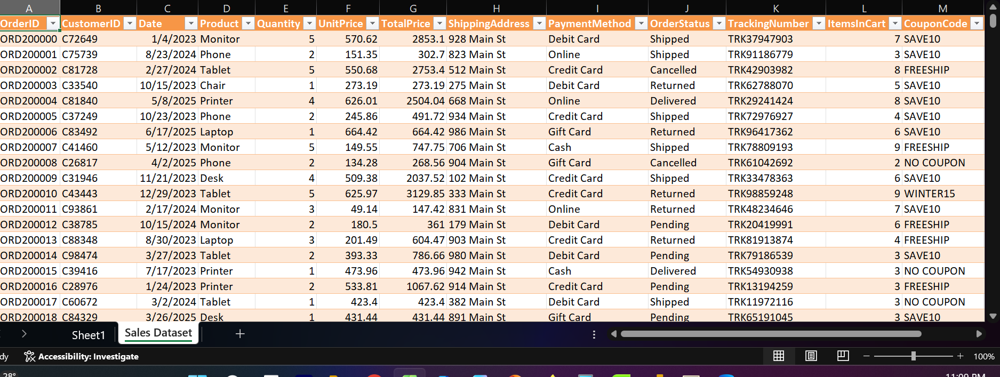

# Week 1 Data Cleaning Project(Excel)

## Project Overview
This project focuses on cleaning a raw dataset using Excel and Power Query to prepare it for analysis.

## Objectives
- Identify and handle missing values
- Remove duplicate records
- Correct data formats
- Prepare data for analysis

## Tools Used
- Microsoft Excel
- Power Query

## Data Cleaning Steps
1. Removed duplicate records
2. Corrected date formats
3. Replaced null values
4. Validated dataset consistency

## Outcome
The dataset was successfully cleaned and prepared for further analysis.

## Project Screenshot

